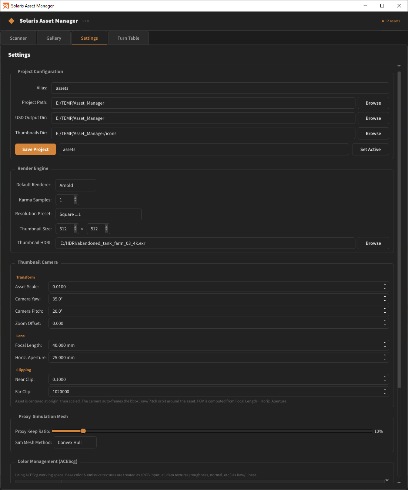
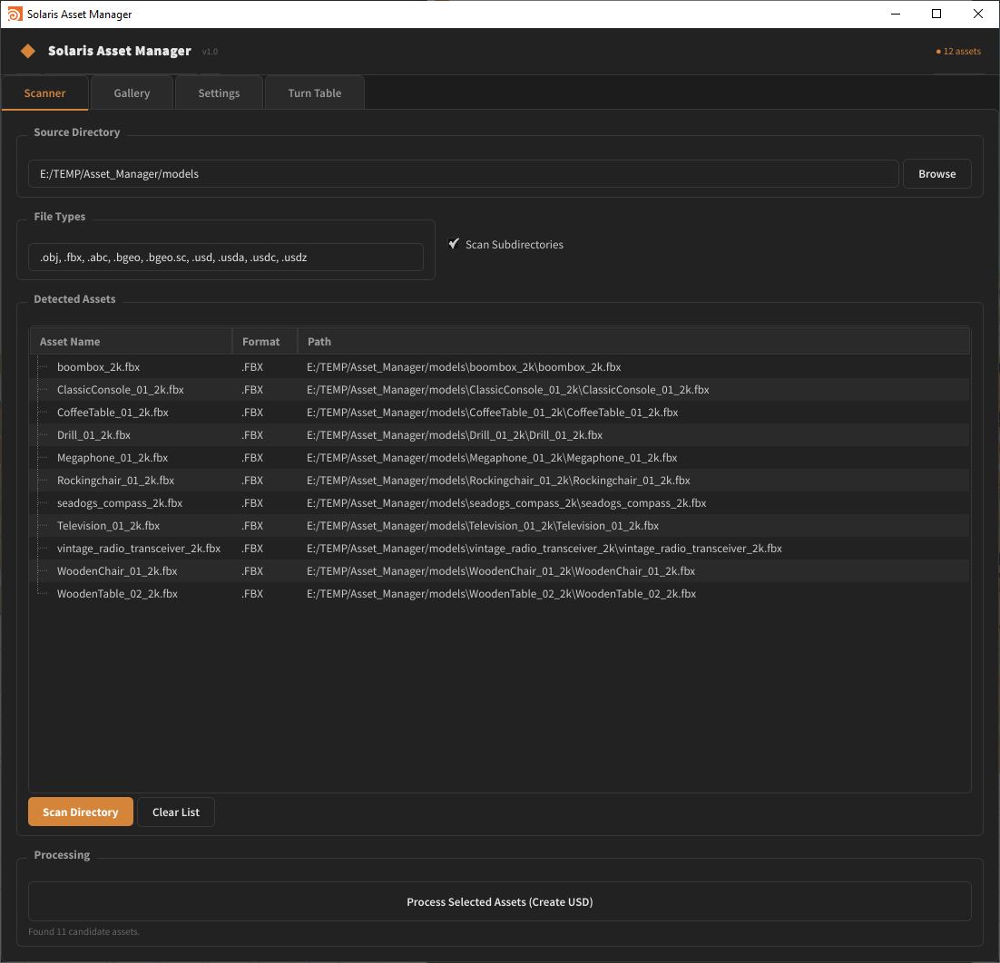
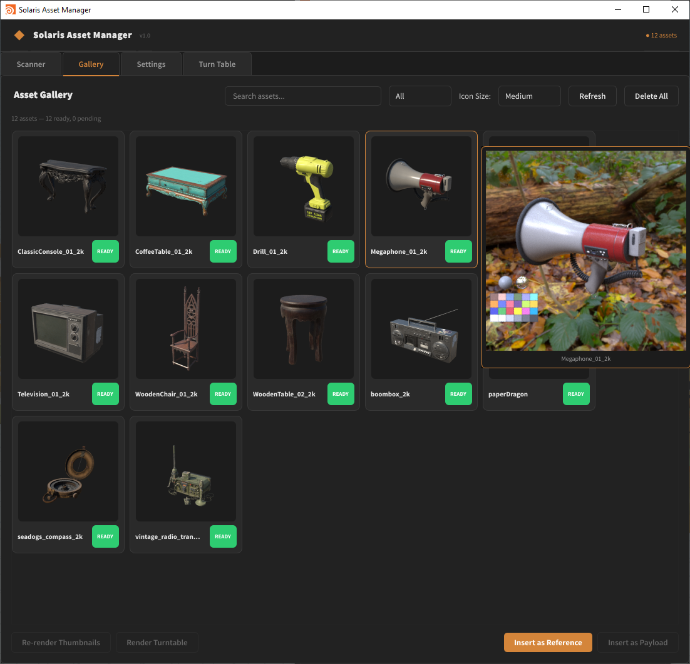
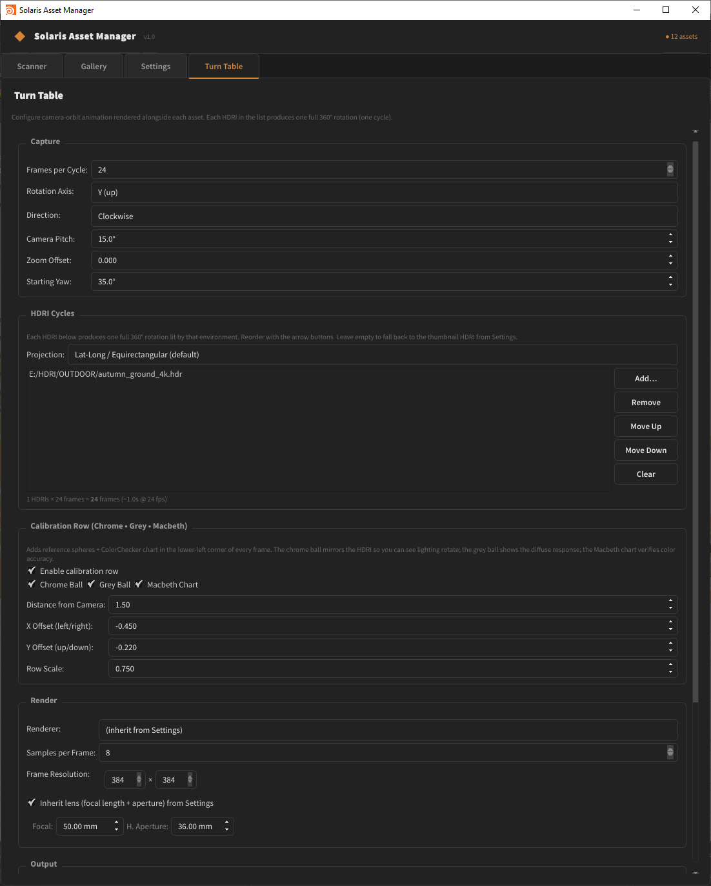

# Houdini Solaris LOP Asset Manager

A complete USD pipeline tool for Houdini Solaris (20+) that automates asset ingestion, MaterialX material assignment, and gallery-based scene assembly.

## Features

- **Directory Scanner** — Recursively discovers 3D models and auto-groups textures by naming convention
- **MaterialX Material Builder** — Auto-creates `mtlxstandard_surface` shading networks with ACEScg color management
- **USD Component Builder** — Composes assets with render, proxy (PolyReduce), and simulation (convex hull) geometry
- **Gallery Manager** — Thumbnail grid with search, filter, drag-and-drop to scene
- **PDG Batch Processing** — TOP networks for parallel asset processing
- **Multi-Renderer** — Karma (CPU/XPU), Arnold, and Redshift via standard MaterialX
- **SQLite Database** — Per-project asset catalog with project alias support
- **ACEScg Pipeline** — Industry-standard OCIO colorspace assignments per texture type

## Screenshots

| | |
|:---:|:---:|
| **Settings Tab** — Project alias, renderer config, and output directory setup | **Scanner Tab** — Directory scanning and batch processing controls |
|  |  |
| **Gallery Tab** — Thumbnail grid with search, filter, and drag-and-drop | **Turntable Setup** — Automated turntable rendering configuration |
|  |  |

## Quick Start

### 1. Set Up Houdini Environment

Add the scripts directory to your `PYTHONPATH` (or run once in the Python Shell):

```python
import sys
sys.path.insert(0, r"E:\PROJECTS\ASSET_MANAGER\scripts")
from asset_manager.launcher import setup_houdini_env
setup_houdini_env()
```

### 2. Launch the Panel

**Option A — Shelf Tool:**
Install `shelf/asset_manager.shelf` via Edit > Shelves > Install Shelf Tool

**Option B — Python Shell:**
```python
from asset_manager.launcher import launch_panel
launch_panel()
```

**Option C — Python Panel:**
```python
from asset_manager.launcher import register_python_panel
register_python_panel()  # Follow the printed instructions
```

### 3. Workflow

1. **Settings Tab** → Create a project alias and set output directories
2. **Scanner Tab** → Add source directories, click "Scan Directories"
3. Review discovered assets in the results table
4. Select renderer (Karma/Arnold/Redshift) and click "Process All Assets"
5. **Gallery Tab** → Browse processed assets with thumbnails
6. **Drag & drop** or double-click to insert assets into your Solaris scene

## Project Structure

```
ASSET_MANAGER/
├── config/
│   ├── naming_conventions.json    # Texture suffix → map type mappings
│   └── renderer_settings.json     # Per-renderer config + ACEScg colorspaces
├── scripts/asset_manager/
│   ├── core/
│   │   ├── scanner.py             # Recursive directory scanner
│   │   ├── materialx_builder.py   # MaterialX network builder
│   │   ├── component_builder.py   # USD asset composer
│   │   ├── proxy_generator.py     # PolyReduce / convex hull
│   │   ├── thumbnail_renderer.py  # Auto-framed thumbnail rendering
│   │   └── usd_utils.py           # Helpers, ACEScg colorspaces
│   ├── database/
│   │   ├── models.py              # Data models (TextureSet, AssetEntry, etc.)
│   │   └── asset_db.py            # SQLite database with project aliases
│   ├── pdg/
│   │   └── batch_processor.py     # PDG/TOP network builder
│   ├── ui/
│   │   ├── main_panel.py          # Main QTabWidget (Python Panel entry)
│   │   ├── scanner_tab.py         # Directory scan + batch processing
│   │   ├── gallery_tab.py         # Asset grid + drag-and-drop
│   │   ├── settings_tab.py        # Project, renderer, proxy settings
│   │   ├── thumbnail_widget.py    # Draggable thumbnail card
│   │   └── styles.py              # Dark theme stylesheet
│   └── launcher.py                # Shelf tool + panel registration
├── shelf/
│   └── asset_manager.shelf        # Houdini shelf tool XML
└── tests/
    └── test_scanner.py            # Standalone test suite
```

## Texture Naming Convention

The scanner matches textures to assets using filename suffixes:

| Map Type | Recognized Suffixes |
|----------|-------------------|
| Base Color | `_basecolor`, `_albedo`, `_diffuse`, `_col`, `_diff` |
| Roughness | `_roughness`, `_rough`, `_rgh` |
| Metallic | `_metallic`, `_metal`, `_met` |
| Normal | `_normal`, `_nml`, `_nor`, `_nrm` |
| Displacement | `_displacement`, `_disp`, `_height` |
| Opacity | `_opacity`, `_alpha`, `_mask` |
| Emissive | `_emissive`, `_emit`, `_emission` |
| AO | `_ao`, `_ambientocclusion`, `_occlusion` |

UDIM textures are detected automatically (e.g. `asset_basecolor.1001.exr`).

## ACEScg Color Management

| Texture Type | OCIO Colorspace |
|-------------|----------------|
| Base Color, Emissive | `Utility - sRGB - Texture` |
| Roughness, Metallic, Normal, Displacement, Opacity, AO | `Utility - Raw` |
| Working Space | `ACES - ACEScg` |

## Requirements

- Houdini 20+ (PySide6)
- Python 3.10+
- Optional: Arnold / Redshift plugins for those renderers

## Running Tests

```bash
python tests/test_scanner.py
```

Tests validate the scanner (naming convention parsing, UDIM handling), SQLite database (CRUD, search, project aliases), and data model serialization — all without requiring Houdini.
